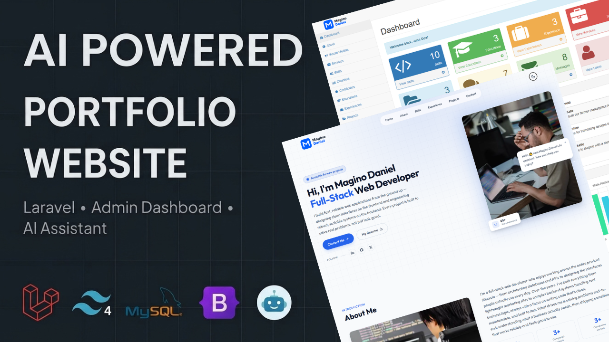
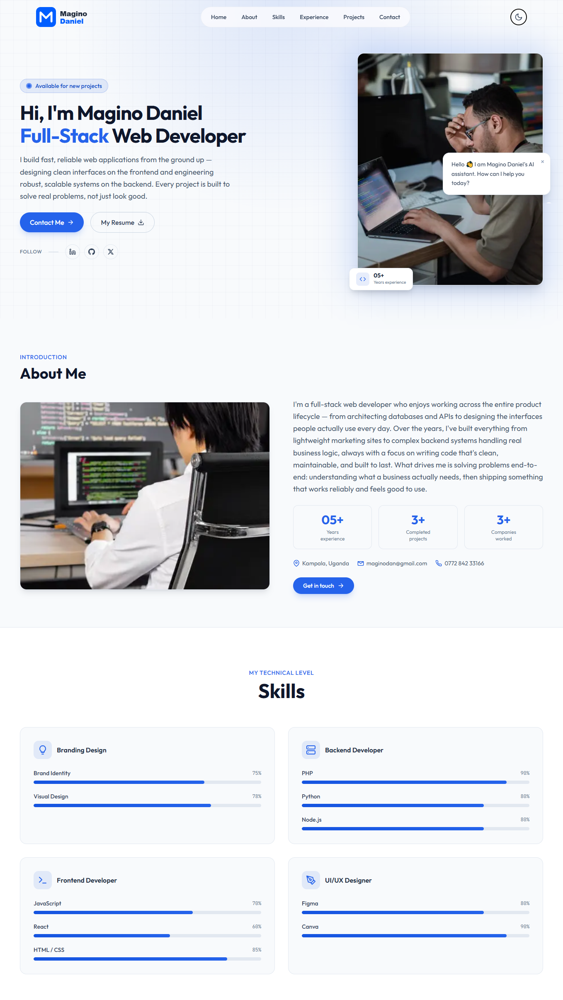
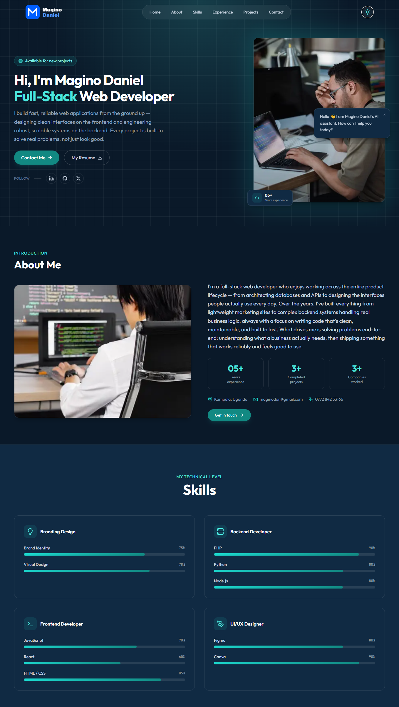
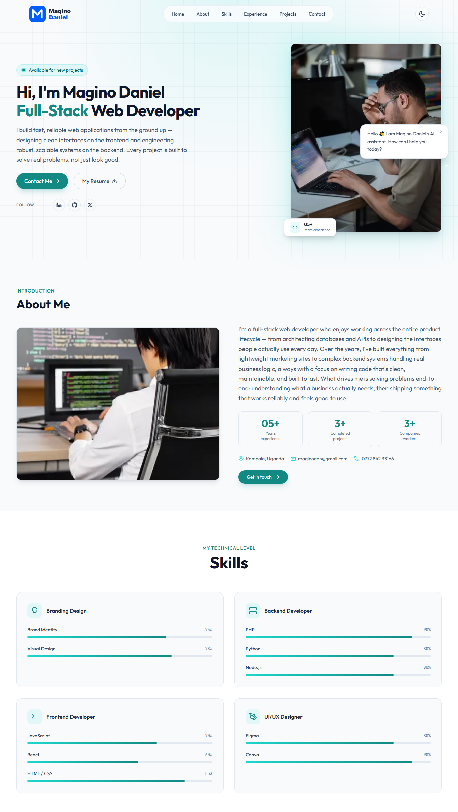
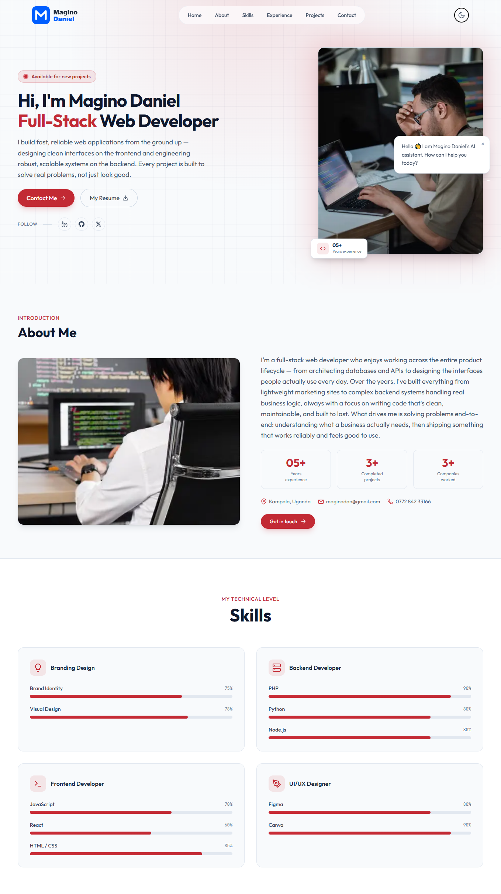
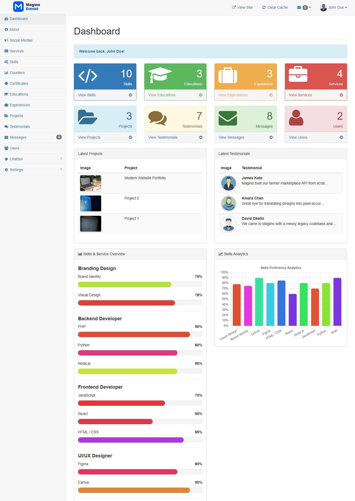
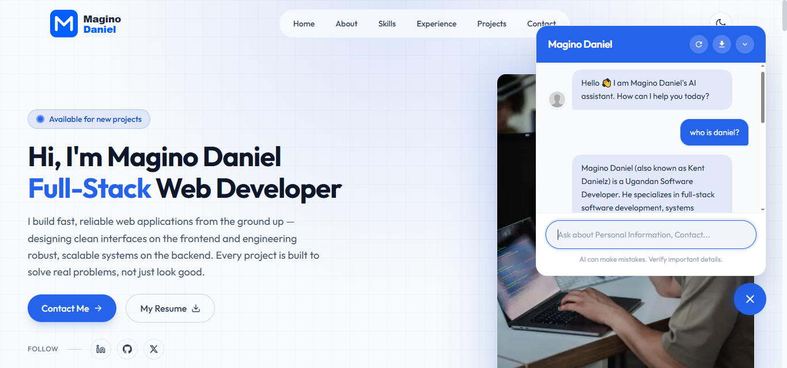
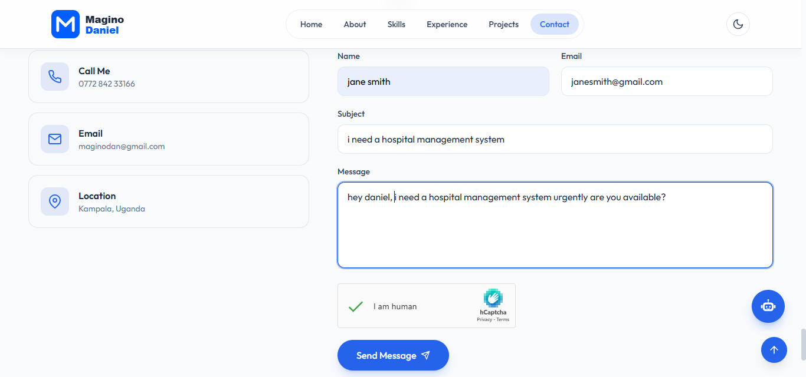
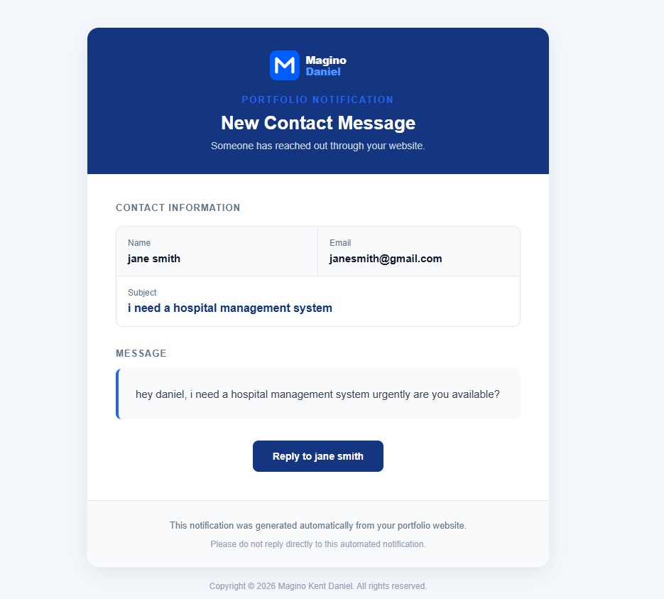

# Magino Daniel — Full-Stack Software Developer Portfolio

<p align="center">
  <strong>A modern, responsive Laravel portfolio website with an integrated admin dashboard, AI-powered portfolio assistant, content management, SEO settings, and configurable site settings.</strong>
</p>

<p align="center">
  <a href="https://portfolio.maginodaniel.com">
    
  </a>
  <a href="https://maginodaniel.com">
    
  </a>
  <a href="https://github.com/maginodan">
    
  </a>
  <a href="mailto:maginodan@gmail.com">
    
  </a>
</p>


<p align="center"> 
  
  
  
  
  
  
  
  
  
</p>

---

## 📸 Portfolio Preview

> **Add your portfolio mockup image here.**
>
> Place your image in the root of the repository and name it:
>
> `portfolio-preview.png`

<p align="center">
  
</p>

---

## 🚀 About the Project

This project is the personal developer portfolio of **Magino Daniel**, a Software Engineer and Full-Stack Developer.

It is built with **Laravel** and designed not only as a portfolio website, but also as a small content-management platform that allows the portfolio owner to manage content through an authenticated administration dashboard.

The application combines a public-facing portfolio with backend management functionality for:

* Personal information
* Services
* Skills
* Education
* Professional experience
* Projects
* Testimonials
* Certificates
* Social media links
* Portfolio counters
* SEO configuration
* Legal pages (Terms, Privacy policy)
* Cookie consent
* Site branding
* Contact messages
* AI chatbot knowledge
* AI provider configuration

The project is structured to demonstrate practical full-stack development, database design, authentication, administration, deployment, and application security.

---

## ✨ Features

### 🌐 Public Portfolio

* Responsive portfolio website
* Hero section
* About section
* Services
* Skills with proficiency levels
* Education
* Professional experience
* Projects
* Testimonials
* Certificates
* Contact section
* Social media links
* Custom site branding
* Cookie consent
* SEO metadata

### 🛠️ Administration Dashboard

Authenticated administrators can manage portfolio content through the dashboard.

* Dashboard overview
* About management
* Services management
* Skills management
* Education management
* Experience management
* Projects management
* Testimonials management
* Certificates management
* Media/social links
* Portfolio counters
* SEO settings
* Legal pages (Terms, Privacy policy)
* Site settings
* Contact messages
* AI chatbot configuration

### 🤖 AI Portfolio Assistant

The portfolio includes an AI-powered assistant designed to answer questions about Magino Daniel and his professional background.

The assistant uses a knowledge-base-first approach so responses can be grounded in information specifically supplied to the portfolio.

Supported AI providers include:

* Google Gemini
* Groq
* Open Router
* OpenAI 
* Deepseek

The application also supports provider configuration through the administration system.

AI credentials are stored through environment variables and are **not included in the repository**.

### 🔐 Security & Configuration

* Laravel authentication
* Admin authorization
* Environment-based secrets
* Configurable CAPTCHA protection
* Secure password hashing
* Database-backed sessions/cache support
* CSRF protection through Laravel
* Configurable cookie consent
* SEO configuration
* Sensitive credentials excluded from seed data

---

## 🧰 Technology Stack

### Backend

* **Laravel 12**
* **PHP 8.2+**
* MySQL / MariaDB
* Laravel Eloquent ORM
* Laravel Blade

### Frontend

* HTML5
* CSS3
* JavaScript
* Bootstrap (The admin panel UI)
* Tailwind CSS (The frontend UI)

### Development & Deployment

* Git
* GitHub
* Composer
* Artisan
* Linux
* Nginx / Apache
* Docker-compatible deployment environments
NB: This can be deployed on any hosting platform by simply uploading the files, importing the database into phpMyAdmin, and adding the database credentials to the .env file.

---

## 📋 Requirements

Before installing the project, make sure you have:

* PHP **8.2 or newer**
* Composer
* MySQL or MariaDB
* Git
* PHP extensions required by Laravel
* Node.js and npm if you need to compile frontend assets

You can verify your PHP and Composer versions with:

```bash
php -v
composer -V
```

---

# ⚙️ Installation

## 1. Clone the repository

```bash
git clone https://github.com/maginodan/web-portfolio-app.git
```

Move into the project directory:

```bash
cd web-portfolio-app
```

---

## 2. Install PHP dependencies

```bash
composer install
```

---

## 3. Create your environment file

Copy the example environment file:

```bash
cp .env.example .env
```

On Windows PowerShell, you can use:

```powershell
Copy-Item .env.example .env
```

---

## 4. Generate the application key

```bash
php artisan key:generate
```

---

## 5. Configure your database

Open `.env` and configure your database connection:

```env
DB_CONNECTION=mysql
DB_HOST=127.0.0.1
DB_PORT=3306
DB_DATABASE=web_portfolio
DB_USERNAME=root
DB_PASSWORD=
```

Create an empty database, for example:

```text
web_portfolio
```

---

## 6. Run migrations and seed demo data

For a new installation:

```bash
php artisan migrate:fresh --seed
```

This creates the database structure and populates the application with demo content.

> **Warning:** `migrate:fresh` deletes all existing tables and data in the configured database. Only use it on a new or disposable database.

---

## 7. Start the application

```bash
php artisan serve
```

The application will normally be available at:

```text
http://127.0.0.1:8000
```

---

# 🔑 Demo Administrator Account

The seeded application includes a demo administrator account.

```text
Email:    admin@example.com
Password: password123
```

> **Important:** This account is intended for local development/demo purposes. Change the password before using the application in a production environment.

---

# 🎨 Customization

The portfolio can be customized through the administration dashboard.

### Site Branding

You can configure:

* Light logo
* Dark logo
* Favicon
* Footer text
* Primary theme color

### Example Theme Colors

The default theme uses:

```text
#2563EB
```

You can experiment with colors such as:

```text
#128982
#FF0000
#7C3AED
#0F766E
#EA580C
```

The primary color can be changed from the site's settings.

---

# 🤖 AI Configuration

The AI assistant supports configurable providers.

Add the required credentials to `.env`.

Example:

```env
GEMINI_API_KEY=
GROQ_API_KEY=
OPENAI_API_KEY=
OPENROUTER_API_KEY=
DEEPSEEK_API_KEY=
```

Do **not** commit API keys to GitHub.

The application can be configured to use:

* Automatic provider selection
* Gemini
* Groq

The chatbot's knowledge base and behavior can be managed through the administration dashboard.

---

# 🧠 Knowledge Base

The chatbot uses a dedicated knowledge base containing information about the portfolio owner.

Knowledge entries can contain:

* Title
* Content
* Category
* Keywords
* Status

This allows the assistant to provide portfolio-specific responses without relying entirely on generic model knowledge.

The initial seeded knowledge includes areas such as:

* Professional background
* Contact information

Additional knowledge can be added through the administration dashboard.

---

# 🗄️ Database

The project includes migrations for the application's main data structures.

The database contains tables for:

* Users
* About
* Media
* Services
* Skills
* Education
* Experience
* Projects
* Testimonials
* Certificates
* Counters
* Messages
* Site settings
* SEO settings
* Legal pages
* Chatbot categories
* Chatbot knowledge
* Chatbot settings
* Laravel framework tables

The repository uses Laravel migrations rather than requiring a database dump.

This makes it possible for another developer to create a fresh database using:

```bash
php artisan migrate:fresh --seed
```

---

# 🧪 Testing

Run the Laravel test suite with:

```bash
php artisan test
```

The project includes feature and unit tests.

A fresh test database is used by the test environment, allowing migrations and application behavior to be tested without modifying the development database.

---

# 📁 Project Structure

The project follows the standard Laravel application structure, with additional folders for the portfolio content, AI assistant, admin dashboard, uploaded media, and frontend assets.

```text
web-portfolio-app/
│
├── app/
│   ├── Helpers/              # Reusable helper functions
│   ├── Http/
│   │   ├── Controllers/      # Application and admin controllers
│   │   ├── Middleware/       # HTTP middleware
│   │   └── Requests/         # Form validation requests
│   ├── Mail/                 # Email classes and notifications
│   ├── Models/               # Eloquent database models
│   ├── Providers/            # Laravel service providers
│   └── Rules/                # Custom validation rules
│
├── bootstrap/
│   ├── cache/                # Laravel framework cache
│   ├── app.php               # Application bootstrap configuration
│   └── providers.php         # Application service providers
│
├── config/
│   ├── ai.php                # AI assistant configuration
│   ├── app.php               # Application configuration
│   ├── auth.php              # Authentication configuration
│   ├── cache.php             # Cache configuration
│   ├── database.php          # Database configuration
│   ├── filesystems.php       # File storage configuration
│   ├── logging.php           # Logging configuration
│   ├── mail.php              # Mail configuration
│   ├── queue.php             # Queue configuration
│   ├── services.php          # Third-party service configuration
│   └── session.php           # Session configuration
│
├── database/
│   ├── factories/            # Model factories
│   ├── migrations/           # Database structure and schema changes
│   └── seeders/              # Initial/demo database data
│
├── public/
│   ├── assets/               # Public website assets
│   ├── build/                # Compiled frontend assets
│   ├── uploads/              # Uploaded portfolio media and files
│   ├── .htaccess             # Apache configuration
│   ├── index.php             # Application entry point
│   └── robots.txt            # Search engine crawling rules
│
├── resources/
│   ├── css/                  # Source CSS files
│   ├── js/                   # Source JavaScript files
│   └── views/                # Blade templates and UI views
│
├── routes/
│   ├── console.php           # Artisan console routes
│   └── web.php               # Web application routes
│
├── storage/
│   ├── app/                  # Application-generated files
│   ├── framework/            # Laravel framework-generated files
│   └── logs/                 # Application logs
│
├── tests/
│   ├── Feature/              # Feature and integration tests
│   ├── Unit/                 # Unit tests
│   └── TestCase.php          # Base test case
│
├── vendor/                   # Composer PHP dependencies
├── node_modules/             # NPM/Node.js dependencies
│
├── .env.example              # Example environment configuration
├── artisan                   # Laravel command-line interface
├── composer.json             # PHP dependencies and project configuration
├── composer.lock             # Locked Composer dependency versions
├── package.json               # Frontend dependencies and scripts
├── package-lock.json          # Locked NPM dependency versions
├── phpunit.xml               # PHPUnit configuration
├── vite.config.js             # Vite frontend build configuration
├── portfolio-preview.png     # Portfolio preview image
└── README.md                  # Project documentation
```

---

# 🔐 Environment Variables

Never commit your real `.env` file.

Sensitive configuration may include:

```env
APP_KEY=
DB_PASSWORD=

GEMINI_API_KEY=
GROQ_API_KEY=

HCAPTCHA_SITE_KEY=
HCAPTCHA_SECRET_KEY=
```

Use `.env.example` as the template for configuring a new installation.

---

# 🛡️ Production Security

Before deploying the project publicly:

* Change the seeded administrator password
* Generate a unique `APP_KEY`
* Use a production database
* Configure secure database credentials
* Add real AI API credentials through environment variables
* Configure CAPTCHA credentials through environment variables
* Enable HTTPS
* Set `APP_ENV=production`
* Set `APP_DEBUG=false`
* Never commit `.env`
* Never commit database dumps
* Never commit API keys or private credentials

---

# 🖼️ Screenshots

Additional screenshots.

### Public Portfolio

Portfolio Mockup 1
<p align="center">  </p>
Portfolio Mockup 2
<p align="center">  </p>
Portfolio Mockup 3
<p align="center">  </p>
Portfolio Mockup 4
<p align="center">  </p>

### Admin Dashboard

The following image demonstrates the Admin Dashboard of the portfolio application.

<p align="center">  </p>

### AI Assistant

The following image demonstrates the AI-powered portfolio assistant.

<p align="center">  </p>

### Email

The following image demonstrates the email/contact aspect of the portfolio application.

<p align="center">  </p>

<p align="center">  </p>

---

# 🌍 Live Project

Visit the live portfolio:

<p align="center">
  <a href="https://portfolio.maginodaniel.com">
    
  </a>
</p>

---

# 👨‍💻 About the Developer

**Magino Daniel** is a Software Engineer and Full-Stack Developer focused on building practical, secure, and scalable web applications.

His technical interests and experience include:

* Laravel
* Django
* ASP.NET Core
* PHP
* Python
* JavaScript
* Next.js
* REST APIs
* MySQL
* PostgreSQL
* Linux
* Docker
* VPS deployment
* Database engineering
* AI & Machine Learning
* Generative AI
* Retrieval-Augmented Generation

This portfolio project was designed and developed by **Magino Daniel** as both a professional portfolio and a demonstration of full-stack software engineering capabilities.

---

# 📫 Contact

**Magino Daniel**

📧 Email: [maginodan@gmail.com](mailto:maginodan@gmail.com)

🌐 Portfolio: https://maginodaniel.com

💻 GitHub: https://github.com/maginodan

💼 LinkedIn: https://www.linkedin.com/in/magino-daniel-06ab90208/

---

# 📄 License

This project is provided for educational, and portfolio purposes, and other use under MIT LICENSE

If you fork or adapt the project, please respect the original author's work and remove any personal information, credentials, private assets, or identifying content before deploying your own version.

---

<p align="center">
  <strong>Built with Laravel & ❤️ by Magino Daniel</strong>
</p>

<p align="center">
  <a href="https://maginodaniel.com">Portfolio</a>
  •
  <a href="https://github.com/maginodan">GitHub</a>
  •
  <a href="mailto:maginodan@gmail.com">Email</a>
</p>
